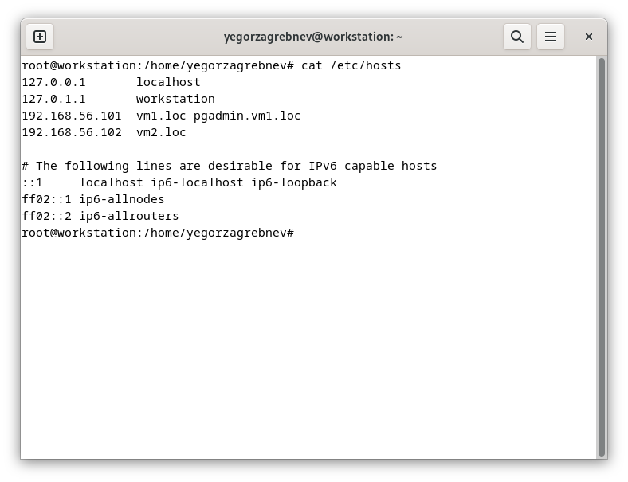

# Тестовое задание. Развёртывание примитивной инфраструктуры на двух виртуальных машинах

## Краткое описание

Реализована инфраструктура из двух виртуальных машин на базе VirtualBox.  
На машине `vm1` развёрнут прокси-сервер Nginx с TLS.  
На второй машине, `vm2`, — PostgreSQL и pgAdmin.

---

## Инструкция по запуску

### Настройка виртуальных машин

1. Установите VirtualBox, если они ещё не установлены.
2. Создайте две виртуальные машины, настроенные на использование образа GNU/Linux (в контексте работы применялся Debian 12 Bookworm).
3. Подключив ISO-образ, установите операционную систему, указав интерфейс `enp0s3` как основной.
3. Настройте адаптеры каждой из виртуальных машин, предварительно переключившись в Expert Mode через GUI:
   - `Adapter 1`: установите значение `Attached to:` в положение `Host-only`;
   - `Adapter 2`: Internal Network (убедитесь, что имя – `intnet`).

### Развёртывание

На обеих ВМ:

```bash
su

apt update -y && apt upgrade -y

apt install -y ca-certificates curl gnupg

install -m 0755 -d /etc/apt/keyrings

curl -fsSL https://download.docker.com/linux/debian/gpg | gpg --dearmor -o /etc/apt/keyrings/docker.gpg

echo "deb [arch=$(dpkg --print-architecture) signed-by=/etc/apt/keyrings/docker.gpg] https://download.docker.com/linux/debian $(lsb_release -cs) stable" | tee /etc/apt/sources.list.d/docker.list > /dev/null

apt update -y && apt install -y docker-ce docker-ce-cli containerd.io docker-buildx-plugin docker-compose-plugin

```

### Реализовано:

- [x] Персистентность данных;
- [x] Проксирование прямых запросов к PSQL;
- [x] Внедрение SSL-сертификатов;
- [x] Обращение с хост-системы к системы внутри гипервизора по доменному имени.

## На чём был затык:
Первоначально проект планировалось развернуть с использованием KVM, однако возникли сложности с настройкой сетей. USB-Wi-Fi-модуль, который использовался на хост-машине, не позволяет по-человечески работать с TAP без плясок с `bridge-utils` и `iptables`, особенно в сочетании с NetworkManager. VirtualBox использован исключительно в силу быстрой и почти безгеморройной настройки (хотя я и признаю, что это бегство от сложностей и, соответственно, от роста).

## Галерея

### 1. Интерфейс pgAdmin


### 2. Простая заглушка, доступная при обращении к корню сайта


### 3. Конфигурация сетей на виртуальных машинах и статус запущенных Docker-контейнеров


### 4. Файл hosts на локальной машине

